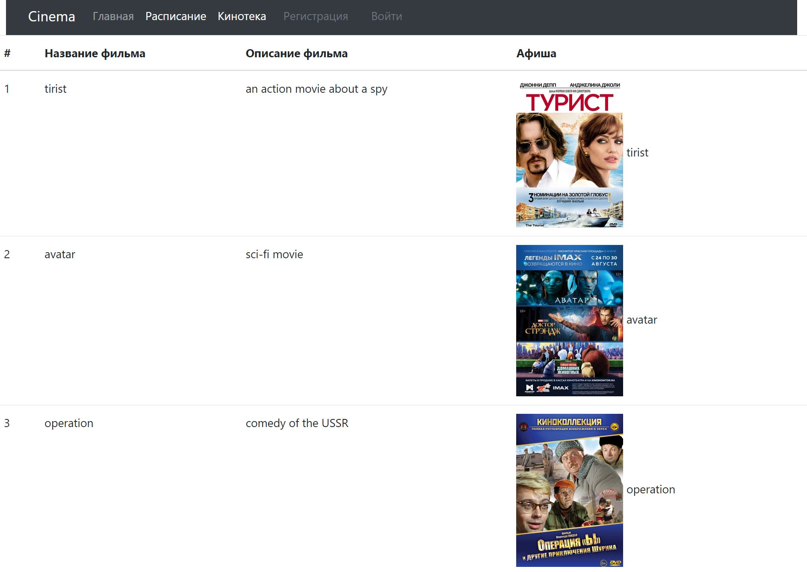

# job4j_cinema

## О проекте

**Приложение _"Кинотеатр"_.**

На главном экране приложения представлены фильмы и общая информация о кинотеатре. 
Предоставляется возможность просмотреть расписание, кинотеку. Здесь же имеется предоставляется 
возможность регистрации. Только зарегистрированные 
пользователю могут покупать билеты. Если пользователь не зарегистрирован и нажимает на кнопку 
"Купить билет", то его перебрасывает на страницу входа.
Все пользователю имеют право просматривать информацию на сайте.

После выбора пользователем понравившегося фильма и времени сеанса,
открывается выпадающие списки с выбором места на данный фильм.
_**Страница с результатом успешной покупки билета. 
Выводит, сообщение пользователю - "Вы успешно приобрели билет на такое место ...".
Страница с результатом неудачной покупки билета (билет уже купили). 
Выводит, сообщение пользователю - "Не удалось приобрести билет на заданное место.".
**_

_Контакты для связи:_
__**kbus94@yandex.ru**__

Для запуска необходимо:
1. [x] Java 17;
2. [x] Maven 3.8.
3. [x] PostgreSql 14.

Стек используемых технологий:
1. Java 17;
2. PostgreSQL JDBC 42.5.4;
3. Spring boot 2.7.4;
4. Thymeleaf 3.0.15;
5. Bootstrap v5.2.2;
6. liquibase 4.15.0;

Перед запуском проекта необходимо создать **БД cinema** и указать
**_login/password_** в файле _src/main/resources/db.properties_;

Запуск приложения:
```
mvn spring-boot:run
```
Интерфейс:
Главная страница.

Расписание.

Кинотека.

Страница покупки билета.

Страница с результатом успешной покупки билета.

Страница с результатом неудачной покупки билета (билет уже купили).

Страница регистрации.

Страница входа.

Ошибка повторной регистрации.
